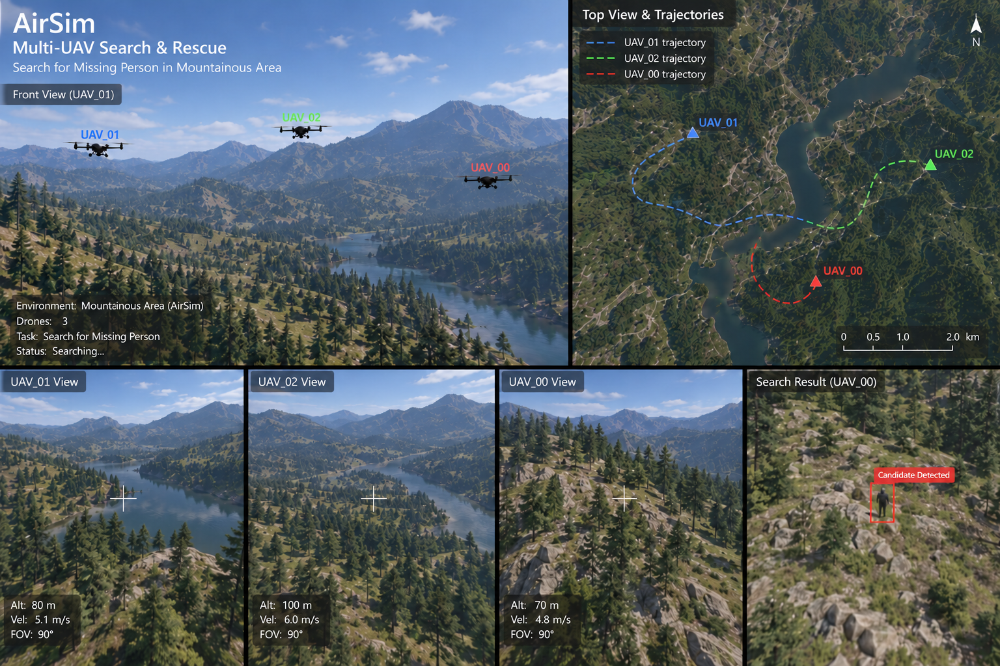
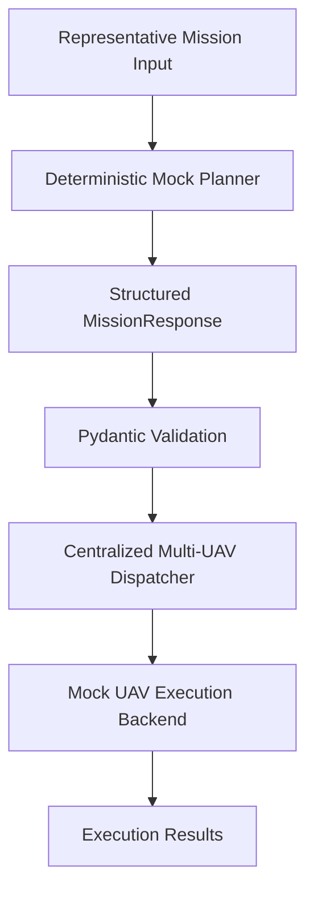

[English](README.md) | 简体中文

# LLM 多无人机任务规划 Demo

一个小型、可独立运行的公开 Demo，用于展示任务规划器与多无人机执行后端之间经过验证的软件接口。

## 演示可视化

<p align="center">
  
</p>

> **研究原型可视化示意图。**  
> 该图展示了原始基于 AirSim 的研究原型中所探索的多无人机协同搜索与救援场景。
> 当前公开的 MVP 版本**不包含** AirSim 实际执行、视觉感知模块或真实飞行遥测数据。

## 项目概述

该项目来源于一个基于 LLM 的多无人机任务规划研究原型。

完整研究原型探索了从自然语言任务指令出发，生成结构化多无人机任务计划，并进一步连接无人机执行模块的任务规划流程。

为了使公开版本能够被独立运行和审阅，本仓库仅保留其中最核心的 **Planning → Validation → Dispatch** 软件边界，并移除了对在线 LLM API、AirSim、Unreal Engine、视觉感知模型及其他研究环境的依赖。

当前公开 Demo 的运行流程为：

```text
代表性任务输入
      ↓
Deterministic Mock Planner
      ↓
结构化 MissionResponse
      ↓
Pydantic Schema Validation
      ↓
Centralized Multi-UAV Dispatcher
      ↓
Mock UAV Execution Backend
```

需要特别说明的是，当前 `MockPlanner` **不会解析任意自然语言指令**。

它会返回一个确定性的代表性多无人机任务 fixture，用于演示从结构化规划结果、Schema 校验到任务分发与执行后端之间的软件接口。

因此，本仓库展示的是原研究系统的一个精简离线 MVP，而不是完整的在线 LLM 规划系统。

---

## 系统架构



各模块职责相互分离：

- **Planner**：产生结构化的多无人机任务计划；
- **Schema / Parser**：定义任务数据结构，并在任务进入执行层前完成确定性校验；
- **Dispatcher**：将每架 UAV 的结构化任务映射为对应的执行动作；
- **Execution Backend**：提供统一的执行接口；当前公开版本使用 Mock Backend。

这种设计使规划层与执行层之间通过明确的结构化数据边界连接，而不是直接将模型输出交给执行系统。

---

## 核心功能

当前 Public Demo 支持：

- 结构化多无人机任务表示；
- 基于 Pydantic 的类型与字段校验；
- UAV 标识符与枚举约束；
- 跨任务一致性校验；
- 集中式多无人机任务分发；
- Mock UAV 执行后端；
- 无需 API Key、GPU、AirSim 或 Unreal Engine 的离线运行；
- 基础单元测试与异常任务拒绝。

当前版本**不包含**：

- 在线 GPT-4o / LLM API 调用；
- OpenAI Structured Outputs；
- Function Calling / Tool Calling；
- AirSim 执行后端；
- Unreal Engine 实现；
- YOLO / VLM 视觉推理；
- PPO / 强化学习导航；
- Agent Memory；
- 自动 Replanning；
- MCP、LangGraph、AutoGen 或 RAG；
- 去中心化 Multi-Agent Framework。

---

## 快速开始

### 环境要求

推荐使用：

```text
Python 3.10+
```

创建并激活虚拟环境：

```bash
python3 -m venv .venv
source .venv/bin/activate
```

安装依赖：

```bash
python -m pip install -r requirements.txt
```

### 运行 Demo

```bash
python demo/run_demo.py --mock
```

该命令不需要：

- OpenAI API Key
- GPU
- AirSim
- Unreal Engine

运行过程中会明确显示：

```text
[MOCK LLM]
```

以及：

```text
[MOCK UAV EXECUTION]
```

用于区分模拟行为与真实在线 LLM / UAV 执行。

### 运行测试

```bash
pytest
```

当前验证结果：

```text
5 passed
```

---

## Demo 流程

Public Demo 使用一个确定性的代表性任务来模拟规划器输出。

Planner 首先生成结构化的多无人机任务：

```text
Mock Planner
      ↓
MissionResponse
      ↓
Per-UAV Tasks
```

一个 Mission 中可以包含多架 UAV 的独立任务，例如：

```text
UAV_00 → Relay
UAV_01 → Search Region A
UAV_02 → Search Region B
```

任务不会被直接发送至执行后端，而是首先进入 Pydantic 校验层。

校验通过后：

```text
Validated Mission
      ↓
Dispatcher
      ↓
Per-UAV Execution Action
      ↓
Mock Backend
```

最终由 Mock Backend 模拟各 UAV 的任务执行，并返回执行结果。

---

## 数据模型与校验

结构化任务 Schema 位于：

```text
src/uav_agent_demo/schema/
```

核心模型包括 `MissionResponse`、Mission Plan 以及单架 UAV 的任务表示。

Pydantic 不仅用于基本类型检查，还承担部分确定性任务约束。

例如，Public Demo 会检查：

- UAV ID 是否符合预期格式；
- UAV ID 是否重复；
- Role / Movement 等字段是否属于合法枚举；
- Heading 是否位于合法范围；
- `STAY` 状态与 Heading 是否一致；
- 多 UAV 任务之间是否满足必要的一致性约束；
- Relay 任务是否正确分配给 `UAV_00`。

因此，规划结果需要先通过：

```text
Planner Output
      ↓
Parsing
      ↓
Pydantic / Deterministic Validation
      ↓
Validated Mission
```

之后才能进入 Dispatcher。

这里的 Validation 是**生成后的确定性校验**，不等同于 OpenAI 原生 Structured Outputs，也不意味着模型生成结果天然保证合法。

---

## Dispatcher 与 Mock Backend

Dispatcher 位于：

```text
src/uav_agent_demo/executor/dispatcher.py
```

它负责将经过验证的 per-UAV task 转换为执行后端能够处理的动作。

整体关系为：

```text
Validated UAVTask
      ↓
Dispatcher
      ↓
Backend Action
      ↓
Execution Result
```

当前公开版本使用：

```text
MockBackend
```

因此所有执行行为都是模拟的。

该设计的目的在于保留原研究系统中 **Planning → Execution** 的接口关系，同时避免要求公开 Demo 的使用者配置复杂的无人机仿真环境。

---

## Planner

当前公开版本的 Planner 位于：

```text
src/uav_agent_demo/planner/mock.py
```

`MockPlanner` 是一个 deterministic fixture，而不是真实 LLM client。

它的作用是提供一个稳定、可复现的结构化任务输出，使本仓库能够独立展示：

```text
Structured Plan
→ Validation
→ Dispatch
→ Execution Backend
```

而不依赖外部模型服务。

仓库中的：

```text
configs/research_prompt_reference.yaml
```

仅作为研究原型中 Prompt / Few-shot 方法的参考材料。

**当前运行时不会加载或执行该文件。**

同样：

```text
configs/reference_constraints.yaml
```

仅用于记录研究原型中的部分场景约束参考。

**当前 Public Demo 不会加载或执行其中的 Scene Rules。**

---

## 项目结构

```text
public_demo/
├── .gitignore
├── LICENSE
├── README.md
├── README_zh-CN.md
├── configs/
│   ├── reference_constraints.yaml
│   └── research_prompt_reference.yaml
├── demo/
│   └── run_demo.py
├── requirements.txt
├── src/
│   └── uav_agent_demo/
│       ├── __init__.py
│       ├── executor/
│       │   ├── __init__.py
│       │   ├── dispatcher.py
│       │   └── mock_backend.py
│       ├── planner/
│       │   ├── __init__.py
│       │   └── mock.py
│       └── schema/
│           ├── __init__.py
│           ├── mission.py
│           └── parser.py
└── tests/
    ├── conftest.py
    └── test_mvp.py
```

---

## 设计思路

### 为什么使用结构化任务？

LLM 输出不能直接作为无人机执行指令。

规划结果首先被转换为具有明确字段和约束的任务表示，使规划层与执行层之间形成清晰的软件接口。

### 为什么在执行前进行 Validation？

模型生成结果可能存在：

- 字段缺失；
- 类型错误；
- 非法枚举；
- UAV 标识符错误；
- 单任务字段之间不一致；
- 多 UAV 任务之间存在冲突。

因此，在 Dispatcher 之前加入确定性校验层，可以阻止明显非法的任务进入执行系统。

### 为什么分离 Planner 和 Executor？

Planner 负责：

```text
What should each UAV do?
```

Execution Backend 负责：

```text
How should the requested action be executed?
```

两者通过结构化 Mission Contract 连接。

这种设计降低了规划逻辑与具体仿真/控制平台之间的耦合。

### 为什么 Public Demo 使用 Mock Backend？

完整研究环境依赖无人机仿真平台和额外模型组件，不适合作为一个轻量级公开仓库的运行前提。

Mock Backend 使项目能够：

```text
git clone
→ install dependencies
→ run demo
```

而无需配置复杂的外部环境。

---

## 测试

当前测试覆盖：

- 合法三无人机 Mission 的解析、校验与 Dispatch；
- 非法 UAV identifier 的拒绝；
- `STAY` 状态下存在非空 Heading 时的拒绝；
- 重复 UAV ID 的拒绝；
- Relay 未分配给 `UAV_00` 时的拒绝；
- 每个 UAV Task 的模拟执行结果。

实际验证结果：

```text
5 passed
```

---

## 当前限制

本仓库有意保持较小规模，因此存在以下边界：

1. 当前 Mock Planner 不解析任意自然语言任务；
2. 当前运行时不调用真实 LLM API；
3. Mock UAV Execution 不等同于 AirSim 仿真执行；
4. Public Demo 不包含视觉感知模块；
5. Public Demo 不包含 PPO / 强化学习导航；
6. 不包含 LLM 自动 Replanning；
7. 不实现 Agent Memory 或通用 Agent Framework；
8. 不实现去中心化多智能体决策。

因此，本仓库更准确的定位是：

> 一个展示结构化任务规划结果如何经过校验并进入多无人机执行层的轻量级公开 Demo。

而不是完整的自主 Agent 系统。

---

## 研究背景

该 Public Demo 来源于一个更完整的多无人机研究原型。

原研究原型探索了：

```text
Natural-Language Mission
        ↓
LLM-based Task Planning
        ↓
Structured Multi-UAV Mission
        ↓
Constraint / Schema Validation
        ↓
UAV Execution
```

研究原型中还包含与无人机仿真和视觉感知相关的实验模块。

为了使本公开仓库：

- 易于运行；
- 易于审阅；
- 不依赖私有研究环境；
- 不需要外部 API；
- 不泄露不适合公开的研究组件；

这些模块没有被包含在当前 Public Demo 中。

因此，本仓库应被视为研究系统中 **planning-to-execution software boundary** 的一个精简、可运行版本，而不是完整研究代码的镜像。